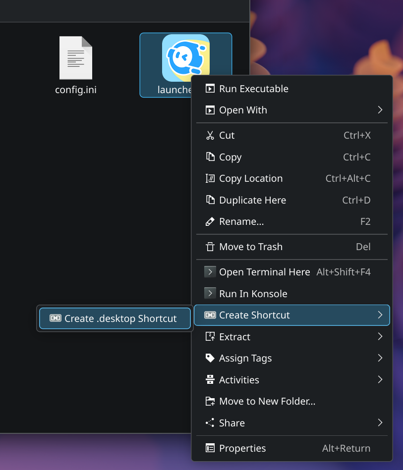
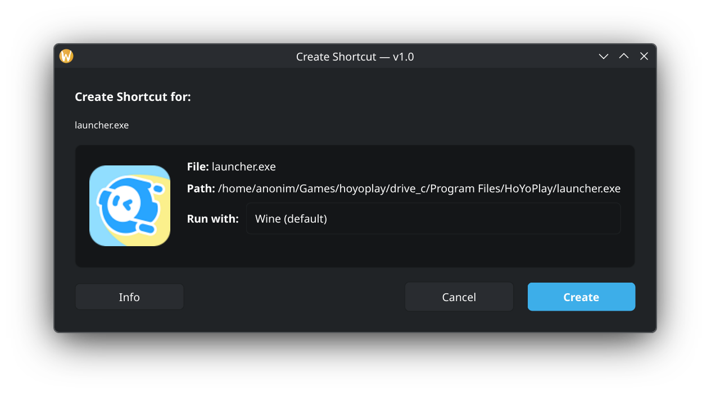
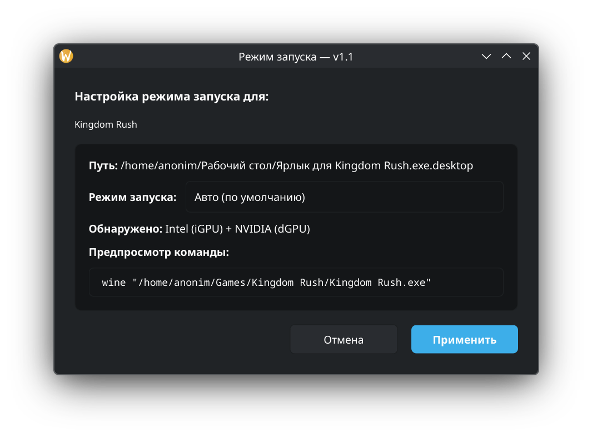

# Plasma-Shortcut — Dolphin Service Menu

[**Русская версия**](README_ru.md) | [](https://aur.archlinux.org/packages/plasma-shortcut)

Adds **"Create Shortcut"**, **"Edit Shortcut"** and **"Launch Mode"** entries to the Dolphin right-click context menu. Creates `.desktop` shortcut files — the Linux equivalent of Windows `.lnk` files.

## Features

- **Create Shortcut** — right-click any file/folder → creates a `.desktop` shortcut next to it
- **Edit Shortcut** — right-click an existing `.desktop` shortcut → change Wine/Proton runner
- **Launch Mode** — right-click any `.desktop` shortcut → choose integrated / NVIDIA GPU for launch. Works with **Flatpak**, **Wine/Proton** and native apps
- **GPU auto-detection** — automatically detects Intel integrated and NVIDIA discrete GPUs
- **.exe support** — creates `Type=Application` shortcuts (works via Wine or Proton)
- **Icon extraction** — automatically extracts and caches icons from `.exe` files (requires `icoutils`)
- **Proton support** — detects installed Proton versions (GE-Proton, Steam Proton, etc.) and allows selecting one
- **GUI dialog** — native Plasma 6 styled dialog with icon preview and runner selector
- **Minimal UI** — clean and simple, nothing extra
- **Native** — no dependencies on PortProton or similar tools
- **Auto-language** — menu and dialog in English / Русский / Українська (auto-detected from system locale)

## Requirements

| Package | Purpose |
|---------|---------|
| `kio` | Dolphin service menu support (usually pre-installed) |
| `icoutils` | Extract icons from `.exe` files |
| `pyside6` | GUI dialog for .exe runner selection |

Install dependencies:

```bash
sudo pacman -S icoutils pyside6
```

## Installation

### Quick install (user only)

```bash
git clone 
https://github.com/Matvel007/Plasma-Shortcut
cd Plasma-Shortcut
./install.sh
```

### System-wide

```bash
sudo ./install.sh
```

### Arch Linux (AUR)

```bash
yay -S plasma-shortcut
# or
paru -S plasma-shortcut
```

### Arch Linux (PKGBUILD manually)

```bash
makepkg -si
```

### Uninstall

```bash
# user install
./uninstall.sh

# system-wide
sudo ./uninstall.sh
```

## Screenshots

<p align="center">
  
  
</p>

<p align="center">
  
</p>

## Usage

### Create a shortcut

Right-click any file or folder in Dolphin → **Create Shortcut** → **Create .desktop Shortcut**

For `.exe` files, a GUI dialog opens with:
- Icon preview (extracted from the .exe)
- Runner selector: **Wine** (default) or any installed **Proton** version
- Click **Create** → `.desktop` file appears in the same directory

Drag the `.desktop` file to your desktop or panel to pin it.

### Edit a shortcut

Right-click an existing `.desktop` shortcut → **Edit Shortcut** → change Wine ↔ Proton → **Save**

### Configure GPU launch mode

Right-click any `.desktop` shortcut → **Launch Mode** → choose **Auto**, **Intel (iGPU)** or **NVIDIA (dGPU)** → **Apply**

The dialog auto-detects your system's GPUs. Works with:
- **Flatpak** apps (uses `flatpak override`)
- **Wine/Proton** shortcuts
- **Native** apps
- **AUR/system** packages (auto-copies to `~/.local/share/applications/`)

For Flatpak/NVIDIA: sets `__NV_PRIME_RENDER_OFFLOAD=1`, `__GLX_VENDOR_LIBRARY_NAME=nvidia`, `__VK_LAYER_NV_optimus=NVIDIA_only`.

## Project structure

```
Plasma-Shortcut/
├── install.sh                         # Install script
├── uninstall.sh                       # Uninstall script
├── PKGBUILD                           # Arch Linux package
├── README.md                          # This file
├── README_ru.md                       # Russian readme
├── Plasma-Shortcut.install # Pacman hooks
└── src/
    ├── dolphin-create-shortcut        # Bash script (create mode)
    ├── dolphin-edit-shortcut          # Bash script (edit mode)
    ├── dolphin-launch-mode            # Bash script (launch mode)
    ├── dolphin-shortcut-dialog.py     # Python GUI (create/edit)
    ├── dolphin-launch-mode-dialog.py  # Python GUI (launch mode)
    ├── create-shortcut.desktop        # Service menu (all files)
    ├── edit-shortcut.desktop          # Service menu (.desktop files)
    └── launch-mode.desktop            # Service menu (.desktop files)
```

## License

GNU GPL v2
